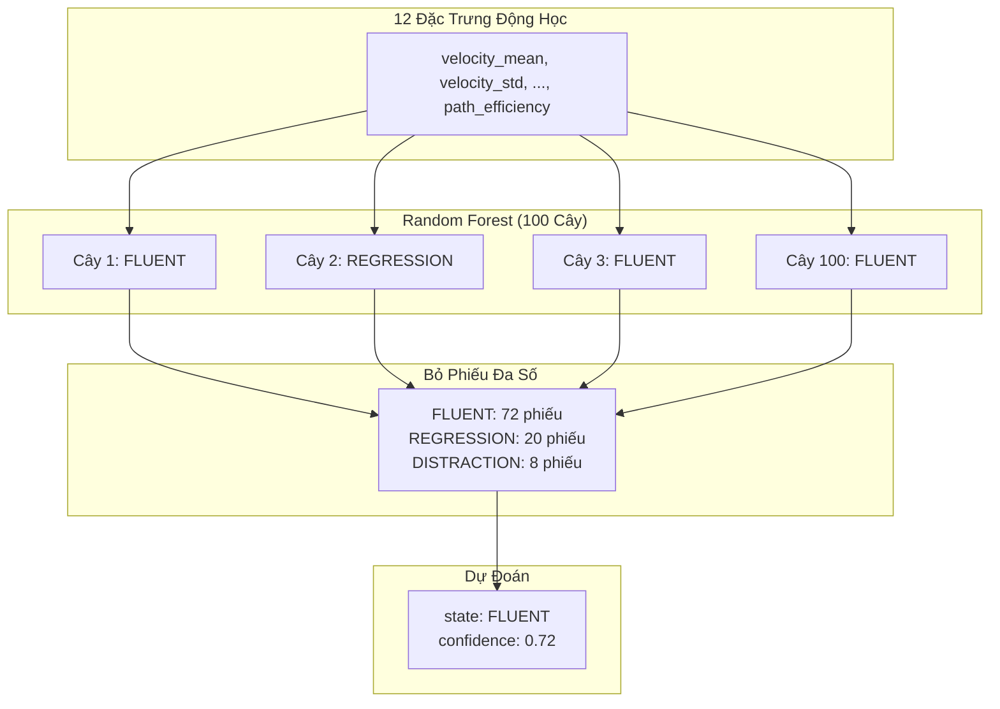
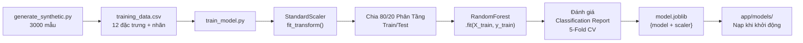
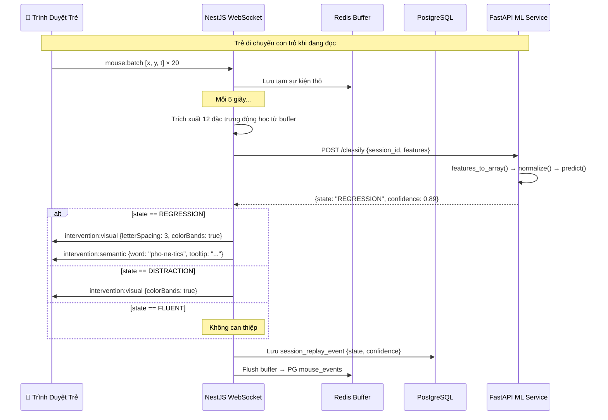

# 🧠 ReadEase ML Service — Phân Tích Kỹ Thuật Chuyên Sâu

> **Phạm vi**: Phân tích toàn bộ `ReadEase-Backend/ml-service/`  
> **Số file được phân tích**: 12 file trong `app/`, `training/`, `tests/`, và thư mục gốc  
> **Ngày**: 21/04/2026

---

## 1. Cấu Trúc Thư Mục & Mục Đích Từng File

```
ml-service/
├── app/                          # Ứng dụng FastAPI chạy runtime
│   ├── __init__.py               # Đánh dấu gói Python
│   ├── main.py                   # Server FastAPI: endpoints, CORS, lifespan, tách từ tiếng Việt
│   ├── schemas.py                # Models Pydantic: schema xác thực request/response
│   ├── classifier.py             # Nạp model, dự đoán, và phân loại dự phòng (fallback)
│   ├── feature_processor.py      # Sắp xếp đặc trưng, chuyển dict→mảng, chuẩn hóa StandardScaler
│   ├── calibration.py            # Tính toán đường cơ sở vận động từ dữ liệu mini-game hiệu chuẩn
│   └── models/
│       └── model.joblib          # Gói model đã huấn luyện: {RandomForest + StandardScaler} (187 KB)
│
├── training/                     # Pipeline huấn luyện model ngoại tuyến
│   ├── generate_synthetic.py     # Tạo 3000 mẫu động học tổng hợp (1000 mỗi lớp)
│   ├── train_model.py            # Huấn luyện RandomForest, đánh giá, xuất model.joblib
│   └── training_data.csv         # Bộ dữ liệu tổng hợp (3000 dòng × 13 cột, 595 KB)
│
├── tests/
│   └── test_classifier.py        # Bộ test Pytest: 9 test cho health, classify, calibrate
│
├── requirements.txt              # Thư viện Python (FastAPI, scikit-learn, numpy, v.v.)
├── Dockerfile                    # Container production: Python 3.10-slim, 2 workers, health check
├── Dockerfile.dev                # Container phát triển: hot-reload (--reload)
└── .gitignore                    # Bỏ qua venv, __pycache__, .pytest_cache
```

### Tóm Tắt Từng File

| File | Dòng | Mục đích |
|------|-----:|----------|
| [main.py](file:///d:/WorkSpace/CAP2/ReadEase-Backend/ml-service/app/main.py) | 201 | Điểm vào ứng dụng FastAPI. Định nghĩa 4 endpoint HTTP (`/`, `/classify`, `/calibrate`, `/segment`), xử lý nạp model qua lifespan, tách từ tiếng Việt bằng `underthesea`, và middleware CORS |
| [schemas.py](file:///d:/WorkSpace/CAP2/ReadEase-Backend/ml-service/app/schemas.py) | 102 | Các class `BaseModel` Pydantic định nghĩa cấu trúc và quy tắc xác thực chính xác cho mọi payload request/response. Đóng vai trò hợp đồng API giữa backend NestJS và dịch vụ này |
| [classifier.py](file:///d:/WorkSpace/CAP2/ReadEase-Backend/ml-service/app/classifier.py) | 134 | Module dự đoán chính. Nạp `model.joblib` khi khởi động, chạy suy luận qua `predict()`, và cung cấp `fallback_predict()` dùng luật ngưỡng thủ công khi model không khả dụng |
| [feature_processor.py](file:///d:/WorkSpace/CAP2/ReadEase-Backend/ml-service/app/feature_processor.py) | 57 | Định nghĩa thứ tự chuẩn 12 đặc trưng (`FEATURE_NAMES`) và cung cấp `features_to_array()` (dict→numpy) và `normalize_features()` (biến đổi StandardScaler) |
| [calibration.py](file:///d:/WorkSpace/CAP2/ReadEase-Backend/ml-service/app/calibration.py) | 87 | Tính đường cơ sở vận động cá nhân hóa từ dữ liệu mini-game hiệu chuẩn 30 giây: vận tốc cơ sở, thời gian phản ứng, điểm chính xác, và phân loại hồ sơ vận động |
| [\_\_init\_\_.py](file:///d:/WorkSpace/CAP2/ReadEase-Backend/ml-service/app/__init__.py) | 2 | Đánh dấu gói Python — chỉ chứa comment `# ReadEase ML Engine` |
| [generate_synthetic.py](file:///d:/WorkSpace/CAP2/ReadEase-Backend/ml-service/training/generate_synthetic.py) | 186 | Tạo 3000 mẫu huấn luyện tổng hợp dùng phân phối ngẫu nhiên numpy, được hiệu chỉnh khớp với các mẫu động học chuột thực tế cho từng trạng thái nhận thức |
| [train_model.py](file:///d:/WorkSpace/CAP2/ReadEase-Backend/ml-service/training/train_model.py) | 124 | Pipeline huấn luyện end-to-end: nạp CSV → chuẩn hóa → chia tập → huấn luyện RandomForest → đánh giá → cross-validate → xuất model.joblib |
| [test_classifier.py](file:///d:/WorkSpace/CAP2/ReadEase-Backend/ml-service/tests/test_classifier.py) | 210 | Bộ test Pytest gồm 9 test case: health check, 3 trạng thái phân loại, thời gian phản hồi <50ms, lỗi xác thực (422), và endpoint hiệu chuẩn |
| [requirements.txt](file:///d:/WorkSpace/CAP2/ReadEase-Backend/ml-service/requirements.txt) | 10 | Thư viện Python: FastAPI 0.115, uvicorn 0.44, scikit-learn 1.5, numpy 2.4, pandas 3.0, underthesea ≥6.8 |
| [Dockerfile](file:///d:/WorkSpace/CAP2/ReadEase-Backend/ml-service/Dockerfile) | 26 | Container production với 2 workers uvicorn, health check mỗi 30 giây |
| [Dockerfile.dev](file:///d:/WorkSpace/CAP2/ReadEase-Backend/ml-service/Dockerfile.dev) | 16 | Container phát triển với `--reload` để hot reload |

---

## 2. Đầu Vào và Đầu Ra của ML

### 2.1 `/classify` — Phân Loại Trạng Thái Nhận Thức

#### Đầu vào: `ClassifyRequest`

WebSocket gateway của backend thu thập các sự kiện chuột thô (`x, y, timestamp`) ở tốc độ ~60fps, lưu tạm trong Redis, và cứ mỗi ~5 giây xử lý một batch thành **12 đặc trưng động học** phía NestJS. Các đặc trưng này sau đó được gửi đến `/classify`.

```json
{
  "session_id": "uuid-của-phiên-đọc",
  "features": {
    "velocity_mean": 200.0,        // pixel/ms: tốc độ con trỏ trung bình
    "velocity_std": 20.0,          // pixel/ms: độ biến thiên tốc độ (tính nhất quán)
    "velocity_max": 320.0,         // pixel/ms: tốc độ đỉnh trong batch
    "acceleration_mean": 5.0,      // pixel/ms²: gia tốc trung bình
    "acceleration_std": 3.0,       // pixel/ms²: độ biến thiên gia tốc
    "curvature_mean": 0.05,        // radian: độ cong đường đi trung bình
    "curvature_std": 0.02,         // radian: độ biến thiên độ cong
    "dwell_time_mean": 120.0,      // ms: thời gian con trỏ dừng trung bình trên mỗi từ
    "dwell_time_max": 200.0,       // ms: thời gian dừng lâu nhất trên bất kỳ từ nào
    "direction_changes": 2,        // số lần: số lần đổi hướng ngang
    "regression_count": 0,         // số lần: số lần nhìn ngược (đọc lại)
    "path_efficiency": 0.85        // tỷ lệ [0, 1]: đường thẳng / khoảng cách thực tế
  }
}
```

**Ý nghĩa thực tế của các đặc trưng:**

| Đặc trưng | Ý Nghĩa Thực Tế | Tín Hiệu Chứng Khó Đọc |
|---------|-------------------|--------------------|
| `velocity_mean` | Tốc độ di chuyển con trỏ dọc theo văn bản | Thấp = đang vật lộn để giải mã từ |
| `velocity_std` | Tốc độ con trỏ nhất quán đến đâu | Cao = đọc thất thường/không chắc chắn |
| `velocity_max` | Đỉnh tốc độ đột biến | Rất cao = không đang đọc, di chuyển ngẫu nhiên |
| `acceleration_mean/std` | Gia tốc mượt mà đến đâu | Std cao = di chuyển giật cục, mất kiểm soát |
| `curvature_mean/std` | Đường đi cong đến đâu | Cao = đọc đi đọc lại qua lại |
| `dwell_time_mean` | Con trỏ dừng bao lâu trên mỗi từ | Cao = từ khó giải mã |
| `dwell_time_max` | Lần dừng lâu nhất | Rất cao = bị kẹt ở một từ cụ thể |
| `direction_changes` | Số lần con trỏ đổi hướng | Cao = đang tìm kiếm vị trí đã mất |
| `regression_count` | Số lần con trỏ đi lùi | **Chỉ số chính** của việc đọc lại |
| `path_efficiency` | Tỷ lệ khoảng cách đường thẳng so với đường đi thực | Thấp = lang thang, không theo dõi văn bản |

#### Đầu ra: `ClassifyResponse`

```json
{
  "state": "FLUENT",             // Một trong: FLUENT | REGRESSION | DISTRACTION
  "confidence": 0.9234,          // float [0, 1]: xác suất lớp cao nhất
  "session_id": "uuid-...",      // Trả lại để đối chiếu request
  "model_version": "1.0.0"       // "1.0.0" cho model đã huấn luyện, "fallback" cho luật
}
```

**Ý nghĩa trạng thái và hành động của backend:**

| Trạng thái | Ý Nghĩa | Can Thiệp Từ Backend |
|-------|---------|----------------------|
| `FLUENT` | Trẻ đang đọc trôi chảy, từ trái sang phải | **Không** — không cần can thiệp |
| `REGRESSION` | Trẻ đang đọc lại, đi ngược, gặp khó khăn | **Trực quan** (tăng khoảng cách chữ, dải màu) + **Ngữ nghĩa** (hiện tooltip từ) |
| `DISTRACTION` | Trẻ đang di chuyển con trỏ ngẫu nhiên, mất tập trung | **Chỉ trực quan** (dải màu để thu hút lại chú ý) |

---

### 2.2 `/calibrate` — Tính Toán Đường Cơ Sở Vận Động

#### Đầu vào: `CalibrateRequest`

Trước khi trẻ bắt đầu đọc, trẻ chơi một mini-game hiệu chuẩn 30 giây (ví dụ: theo dõi mục tiêu). Các sự kiện chuột thô từ game này được gửi để tính đường cơ sở.

```json
{
  "child_id": "uuid-của-trẻ",
  "events": [
    { "x": 100.0, "y": 200.0, "timestamp": 1700000000000.0 },
    { "x": 110.5, "y": 203.2, "timestamp": 1700000000050.0 },
    ...  // tối thiểu 10 sự kiện, thường là 500-1500 sự kiện trong 30 giây
  ],
  "duration": 30000,               // thời gian hiệu chuẩn tính bằng ms
  "game_type": "target_tracking"    // loại mini-game
}
```

#### Đầu ra: `CalibrateResponse`

```json
{
  "child_id": "uuid-...",
  "baseline": {
    "velocity_baseline": 185.42,           // tốc độ con trỏ trung bình của trẻ
    "velocity_range": [45.18, 325.66],     // phạm vi ±2σ (95% tốc độ của trẻ)
    "reaction_time_mean": 342.50,          // thời gian phản ứng trung bình (ms)
    "accuracy_score": 0.7234,              // chỉ số độ mượt đường đi [0, 1]
    "motor_profile": "NORMAL",             // SLOW | NORMAL | FAST
    "calibrated_at": "2026-04-21T04:30:00+00:00"
  }
}
```

---

### 2.3 `/segment` — Tách Từ Tiếng Việt

#### Đầu vào: `SegmentRequest`
```json
{ "text": "con bò ăn cỏ trên đồng xanh" }
```

#### Đầu ra: `SegmentResponse`
```json
{ "segmented": "con_bò ăn cỏ trên đồng_xanh" }
```

Các từ ghép tiếng Việt được nối bằng dấu gạch dưới để frontend có thể tách theo dấu cách và hiển thị chúng như các đơn vị từ đơn lẻ. Điều này rất quan trọng cho trẻ khó đọc, những em cần ranh giới từ phải rõ ràng trực quan.

---

## 3. Giải Thích Thuật Toán

### 3.1 Lựa Chọn Thuật Toán: Random Forest Classifier

Dịch vụ sử dụng bộ phân loại **Random Forest** — một tập hợp gồm 100 cây quyết định bỏ phiếu để chọn lớp cuối cùng.

```python
RandomForestClassifier(
    n_estimators=100,        # 100 cây quyết định độc lập
    max_depth=10,            # Mỗi cây giới hạn 10 tầng
    min_samples_split=5,     # Cần ≥5 mẫu để tách một nút
    class_weight="balanced", # Tự điều chỉnh trọng số cho mất cân bằng lớp
    random_state=42,         # Kết quả có thể tái tạo
)
```

#### Tại Sao Chọn Random Forest Cho ReadEase?

| Yêu Cầu | Tại Sao Random Forest Phù Hợp |
|----------|-------------------------------|
| **Độ trễ thấp (<50ms)** | Suy luận RandomForest có độ phức tạp O(n_trees × depth) — với 100 cây và độ sâu 10, dự đoán mất <5ms. Đủ nhanh cho phân loại thời gian thực khi đọc |
| **Không gian đặc trưng nhỏ** | 12 đặc trưng số là lý tưởng cho phương pháp dựa trên cây. Không cần sức mạnh biểu diễn của mạng nơ-ron |
| **Có thể giải thích** | Mức độ quan trọng của đặc trưng cho thấy tín hiệu động học nào quan trọng nhất (ví dụ: `regression_count`, `dwell_time_mean`). Thiết yếu cho dự án nghiên cứu/đồ án |
| **Bền vững với nhiễu** | Dữ liệu theo dõi chuột vốn có nhiễu. Trung bình hóa tập hợp qua 100 cây làm mượt nhiễu một cách tự nhiên |
| **Không cần GPU** | Chạy trên CPU. Quan trọng cho microservice Docker mà không cần cấp phát GPU |
| **Hoạt động với dữ liệu tổng hợp** | Model cây xử lý tốt dữ liệu tổng hợp có cấu trúc mà không bị overfit như deep learning |
| **Xác suất** | `predict_proba()` cho điểm tin cậy, backend dùng để quyết định mức độ mạnh yếu của can thiệp |

#### Cách Random Forest Hoạt Động (Đơn Giản)



Mỗi cây thấy một tập con ngẫu nhiên của đặc trưng và mẫu (bagging). Mỗi cây độc lập phân loại đầu vào. Dự đoán cuối cùng là bỏ phiếu đa số. Điểm tin cậy là `max(phiếu) / tổng_cây`.

### 3.2 Chuẩn Hóa Đặc Trưng: StandardScaler

Trước khi đưa đặc trưng vào model, `StandardScaler` biến đổi mỗi đặc trưng để có **trung bình bằng 0 và phương sai đơn vị**:

```
đặc_trưng_chuẩn_hóa = (đặc_trưng_thô - trung_bình) / độ_lệch_chuẩn
```

**Tại sao cần thiết?**

| Đặc trưng | Phạm vi điển hình | Không chuẩn hóa |
|---------|--------------|--------------------|
| `velocity_mean` | 50–800 px/ms | Chi phối các phân chia cây |
| `curvature_mean` | 0.02–0.3 radian | Bị bỏ qua bởi cây |
| `direction_changes` | 0–40 đếm | Ảnh hưởng vừa phải |
| `path_efficiency` | 0.05–1.0 tỷ lệ | Bị bỏ qua bởi cây |

Mặc dù model dựa trên cây về mặt kỹ thuật không phụ thuộc vào scale, chuẩn hóa được áp dụng ở đây vì:
1. Scaler được fit trong quá trình huấn luyện và đóng gói cùng model — áp dụng nó khi suy luận đảm bảo tính nhất quán
2. Cung cấp một dạng coding phòng thủ cho tương lai nếu đổi model (ví dụ: SVM, mạng nơ-ron)
3. Phân tích tầm quan trọng đặc trưng có ý nghĩa hơn khi các đặc trưng ở cùng một scale

### 3.3 Tổng Quan Pipeline Huấn Luyện



### 3.4 Bộ Phân Loại Dự Phòng (Fallback)

Khi `model.joblib` không tồn tại hoặc nạp lỗi, hệ thống chuyển sang **luật ngưỡng thủ công**:

```
NẾU regression_count > 5               → REGRESSION (confidence: 0.55)
HOẶC NẾU direction_changes > 15 VÀ
         path_efficiency < 0.3          → DISTRACTION (confidence: 0.55)
HOẶC NẾU velocity_mean > 500           → DISTRACTION (confidence: 0.50)
HOẶC NẾU velocity_mean < 50 VÀ
         regression_count > 2           → REGRESSION (confidence: 0.50)
MẶC ĐỊNH                               → FLUENT (confidence: 0.60)
```

Lưu ý rằng confidence của fallback luôn thấp (0.50–0.60) — điều này báo hiệu cho backend rằng phân loại ít đáng tin cậy hơn, cho phép backend thận trọng hơn với các can thiệp.

---

## 4. Giải Thích Code Từng Dòng

### 4.1 `feature_processor.py` — Nền Tảng

Đây là file đơn giản nhất và cơ bản nhất. Mọi thứ khác đều phụ thuộc vào nó.

```python
"""
Feature Processor — Chuẩn hóa đặc trưng động học dùng StandardScaler.
...
"""

import numpy as np
```

**Dòng 12–26: `FEATURE_NAMES` — Thứ Tự Đặc Trưng Chuẩn**

```python
FEATURE_NAMES = [
    "velocity_mean",       # 1.  Tốc độ con trỏ trung bình
    "velocity_std",        # 2.  Độ biến thiên tốc độ
    "velocity_max",        # 3.  Tốc độ đỉnh
    "acceleration_mean",   # 4.  Gia tốc trung bình
    "acceleration_std",    # 5.  Độ biến thiên gia tốc
    "curvature_mean",      # 6.  Độ cong đường đi trung bình
    "curvature_std",       # 7.  Độ biến thiên độ cong
    "dwell_time_mean",     # 8.  Thời gian dừng trung bình trên mỗi từ
    "dwell_time_max",      # 9.  Thời gian dừng lâu nhất
    "direction_changes",   # 10. Số lần đổi hướng
    "regression_count",    # 11. Số lần nhìn ngược
    "path_efficiency",     # 12. Tỷ lệ đường thẳng / đường đi thực
]
```

> [!IMPORTANT]
> Danh sách này là **nguồn sự thật duy nhất** cho thứ tự đặc trưng. Script huấn luyện dùng cùng tên cột (từ danh sách `COLUMNS` của `generate_synthetic.py`), và `features_to_array()` duyệt danh sách này để xây mảng numpy. **Nếu thứ tự ở đây không khớp với thứ tự dùng khi huấn luyện, model sẽ đưa ra dự đoán sai.**

**Dòng 29–40: `features_to_array()` — Chuyển Đổi Dict sang Mảng**

```python
def features_to_array(features_dict: dict) -> np.ndarray:
    return np.array([features_dict.get(name, 0.0) for name in FEATURE_NAMES])
```

Đoạn này quan trọng một cách tinh tế. Request đến là dict JSON, nhưng scikit-learn cần mảng numpy theo thứ tự cột cụ thể. Hàm này:
1. Duyệt `FEATURE_NAMES` theo thứ tự (không phải thứ tự khóa tùy ý của dict)
2. Dùng `.get(name, 0.0)` — đặc trưng thiếu mặc định về 0.0 thay vì crash
3. Trả về mảng numpy 1D có shape `(12,)`

**Dòng 43–56: `normalize_features()` — Biến Đổi StandardScaler**

```python
def normalize_features(features_array: np.ndarray, scaler) -> np.ndarray:
    # reshape sang 2D cho sklearn (1 mẫu, 12 đặc trưng)
    reshaped = features_array.reshape(1, -1)
    return scaler.transform(reshaped)
```

`StandardScaler.transform()` của scikit-learn yêu cầu mảng 2D shape `(n_mẫu, n_đặc_trưng)`. Vì ta có 1 mẫu khi suy luận, `reshape(1, -1)` chuyển `(12,)` → `(1, 12)`. Scaler sau đó áp dụng: `(x - μ) / σ` cho mỗi đặc trưng dùng trung bình/độ lệch chuẩn đã học khi huấn luyện.

---

### 4.2 `schemas.py` — Hợp Đồng API

**Dòng 17–41: `KinematicFeatures` — Schema 12 Đặc Trưng**

```python
class KinematicFeatures(BaseModel):
    """12 đặc trưng động học từ batch quỹ đạo chuột."""

    # Đặc trưng vận tốc (pixel/ms)
    velocity_mean: float = Field(0.0, description="Tốc độ con trỏ trung bình")
    velocity_std: float = Field(0.0, description="Độ biến thiên tốc độ")
    velocity_max: float = Field(0.0, description="Tốc độ đỉnh")

    # Đặc trưng gia tốc (pixel/ms²)
    acceleration_mean: float = Field(0.0, description="Gia tốc trung bình")
    acceleration_std: float = Field(0.0, description="Độ biến thiên gia tốc")

    # Đặc trưng độ cong (radian)
    curvature_mean: float = Field(0.0, description="Độ cong đường đi trung bình")
    curvature_std: float = Field(0.0, description="Độ biến thiên độ cong")

    # Đặc trưng thời gian dừng (ms)
    dwell_time_mean: float = Field(0.0, description="Thời gian dừng trung bình trên mỗi từ")
    dwell_time_max: float = Field(0.0, description="Thời gian dừng lâu nhất trên một từ")

    # Đặc trưng hành vi
    direction_changes: int = Field(0, description="Số lần đổi hướng ngang")
    regression_count: int = Field(0, description="Số lần nhìn ngược (đọc lại)")
    path_efficiency: float = Field(1.0, description="Tỷ lệ đường thẳng / đường đi thực (0-1)")
```

Mọi trường đều có giá trị mặc định (`0.0` cho float, `0` cho int, `1.0` cho path_efficiency). Điều này có nghĩa backend có thể gửi object đặc trưng không đầy đủ và các trường thiếu sẽ không làm crash dịch vụ — chúng sẽ mặc định về giá trị an toàn.

> [!NOTE]
> `path_efficiency` mặc định là `1.0` (hiệu quả hoàn hảo), không phải `0.0`. Đây là có chủ đích: nếu trường bị thiếu, an toàn hơn khi giả định hành vi bình thường thay vì giả định mất tập trung.

**Dòng 45–56: Classify Request/Response**

```python
class ClassifyRequest(BaseModel):
    session_id: str = Field(..., description="UUID phiên đọc")  # Bắt buộc (...)
    features: KinematicFeatures                                  # Model lồng nhau

class ClassifyResponse(BaseModel):
    state: str = Field(..., description="FLUENT | REGRESSION | DISTRACTION")
    confidence: float = Field(..., ge=0.0, le=1.0)  # Xác thực: 0.0 ≤ confidence ≤ 1.0
    session_id: str
    model_version: str = Field("1.0.0")
```

`Field(...)` nghĩa là trường **bắt buộc** — Pydantic sẽ trả về 422 nếu thiếu. Ràng buộc `ge=0.0, le=1.0` trên confidence đảm bảo nó luôn là xác suất hợp lệ.

**Dòng 61–89: Calibrate Request/Response**

```python
class MouseEvent(BaseModel):
    x: float
    y: float
    timestamp: float = Field(..., description="Unix timestamp tính bằng millisecond")

class CalibrateRequest(BaseModel):
    child_id: str = Field(..., description="UUID người dùng trẻ")
    events: List[MouseEvent] = Field(..., min_length=10)  # Phải có ≥10 sự kiện
    duration: int = Field(30000)                           # Mặc định 30 giây
    game_type: str = Field("target_tracking")
```

`min_length=10` trên `events` đảm bảo Pydantic từ chối request có quá ít điểm dữ liệu **trước khi** code chạy. Đây là tuyến phòng thủ đầu tiên; `calibration.py` có kiểm tra thứ hai.

---

### 4.3 `classifier.py` — Bộ Não

**Dòng 13–32: Thiết Lập và Trạng Thái Toàn Cục**

```python
import os, logging, numpy as np, joblib
from .feature_processor import features_to_array, normalize_features, FEATURE_NAMES

logger = logging.getLogger("ml-engine")

STATES = ["FLUENT", "REGRESSION", "DISTRACTION"]

MODEL_DIR = os.path.join(os.path.dirname(__file__), "models")
MODEL_PATH = os.path.join(MODEL_DIR, "model.joblib")

# Model + scaler toàn cục (nạp một lần khi khởi động)
_model = None
_scaler = None
_model_loaded = False
```

Ba biến toàn cục giữ trạng thái model qua các request. Chúng được thiết lập một lần trong `load_model()` và không bao giờ bị thay đổi — điều này an toàn trong FastAPI async vì dự đoán là xử lý CPU và không liên quan đến trạng thái có thể thay đổi được chia sẻ.

**Dòng 35–59: `load_model()` — Nạp Khi Khởi Động**

```python
def load_model():
    global _model, _scaler, _model_loaded

    if not os.path.exists(MODEL_PATH):
        logger.warning(f"Không tìm thấy file model: {MODEL_PATH} — dùng fallback")
        _model_loaded = False
        return False

    try:
        bundle = joblib.load(MODEL_PATH)   # Deserialize file .joblib
        _model = bundle["model"]           # Instance RandomForestClassifier
        _scaler = bundle["scaler"]         # Instance StandardScaler
        _model_loaded = True
        logger.info(f"Model đã nạp từ {MODEL_PATH}")
        return True
    except Exception as e:
        logger.error(f"Nạp model thất bại: {e}")
        _model_loaded = False
        return False
```

`joblib.load()` deserialize object Python đã pickle từ đĩa. File chứa dictionary với hai khóa:
- `"model"`: Một `RandomForestClassifier` đã fit với 100 cây
- `"scaler"`: Một `StandardScaler` đã fit với các trung bình và độ lệch chuẩn đã học cho cả 12 đặc trưng

Cả hai được lưu cùng nhau trong quá trình huấn luyện (`joblib.dump({"model": clf, "scaler": scaler}, ...)`) để đảm bảo chúng luôn đồng bộ.

**Dòng 67–97: `predict()` — Luồng Dự Đoán Chính**

```python
def predict(features_dict: dict) -> dict:
    if not _model_loaded:
        return fallback_predict(features_dict)     # ← Đường dự phòng

    # Bước 1: Dict → mảng numpy theo thứ tự đặc trưng đúng
    features_array = features_to_array(features_dict)

    # Bước 2: Áp dụng chuẩn hóa StandardScaler
    scaled = normalize_features(features_array, _scaler)

    # Bước 3: Dự đoán RandomForest
    predicted_class = _model.predict(scaled)[0]        # Trả về: "FLUENT"
    probabilities = _model.predict_proba(scaled)[0]    # Trả về: [0.72, 0.20, 0.08]

    # Bước 4: Confidence = xác suất cao nhất qua tất cả các lớp
    confidence = float(max(probabilities))

    return {
        "state": predicted_class,           # "FLUENT" | "REGRESSION" | "DISTRACTION"
        "confidence": round(confidence, 4), # ví dụ: 0.7200
        "model_version": "1.0.0",
    }
```

Toàn bộ luồng dữ liệu trong hàm này:

```
features_dict               features_to_array()          normalize_features()
{"velocity_mean": 200, →    [200, 20, 320, 5, 3,    →   [0.12, -0.45, 0.33,
 "velocity_std": 20,         0.05, 0.02, 120, 200,       -0.67, -0.21, -0.89,
 ...}                        2, 0, 0.85]                  ...]
                             shape: (12,)                  shape: (1, 12)

                             _model.predict()              _model.predict_proba()
                             → ["FLUENT"]                  → [[0.72, 0.20, 0.08]]
                                                               ↑       ↑       ↑
                                                            FLUENT  REGR.  DISTR.
```

> [!IMPORTANT]
> `predict_proba()` trả về xác suất cho cả 3 lớp (theo thứ tự bảng chữ cái mặc định: DISTRACTION, FLUENT, REGRESSION). `predicted_class` từ `predict()` là lớp có xác suất cao nhất. `confidence` đơn giản là `max(probabilities)`.

**Dòng 100–133: `fallback_predict()` — Luật Dựa Trên Ngưỡng**

```python
def fallback_predict(features_dict: dict) -> dict:
    velocity = features_dict.get("velocity_mean", 0)
    regressions = features_dict.get("regression_count", 0)
    direction_changes = features_dict.get("direction_changes", 0)
    path_eff = features_dict.get("path_efficiency", 1.0)
```

Chỉ trích xuất 4 đặc trưng phân biệt nhất. Các luật được đánh giá từ trên xuống (khớp đầu tiên thắng):

```python
    # Luật 1: Nhiều lần đọc lại → REGRESSION
    if regressions > 5:
        return {"state": "REGRESSION", "confidence": 0.55, "model_version": "fallback"}
```
Nếu trẻ đi ngược hơn 5 lần trong batch, trẻ đang đọc lại. Confidence giới hạn ở 0.55 vì đây là heuristic đơn giản.

```python
    # Luật 2: Nhiều lần đổi hướng + hiệu quả đường đi thấp → DISTRACTION
    if direction_changes > 15 and path_eff < 0.3:
        return {"state": "DISTRACTION", "confidence": 0.55, "model_version": "fallback"}
```
Con trỏ thất thường với đường đi rất kém hiệu quả = hành vi mất tập trung.

```python
    # Luật 3: Vận tốc rất cao → DISTRACTION
    if velocity > 500:
        return {"state": "DISTRACTION", "confidence": 0.50, "model_version": "fallback"}
```
Di chuyển con trỏ cực nhanh = chắc chắn không đang đọc từ.

```python
    # Luật 4: Vận tốc rất thấp + một vài lần đọc lại → REGRESSION
    if velocity < 50 and regressions > 2:
        return {"state": "REGRESSION", "confidence": 0.50, "model_version": "fallback"}
```
Con trỏ chậm + đọc lại = đang vật lộn với từ khó.

```python
    # Mặc định: FLUENT
    return {"state": "FLUENT", "confidence": 0.60, "model_version": "fallback"}
```
Khi nghi ngờ, giả định trẻ đang đọc bình thường. Đây là mặc định an toàn nhất: can thiệp sai (false-positive) gây gián đoạn hơn so với bỏ lỡ một lần gặp khó thật sự.

---

### 4.4 `calibration.py` — Tính Đường Cơ Sở Vận Động

**Dòng 15–27: Điểm Vào**

```python
def compute_baseline(events: list) -> dict:
    if len(events) < 10:
        raise ValueError("Cần ít nhất 10 sự kiện để hiệu chuẩn")
```

Tuyến phòng thủ thứ hai (sau `min_length=10` của Pydantic). Bảo vệ chống lại các lời gọi trực tiếp bỏ qua schema API.

**Dòng 29–40: Tính Vận Tốc**

```python
    velocities = []
    for i in range(1, len(events)):
        dx = events[i]["x"] - events[i - 1]["x"]           # Dịch chuyển ngang
        dy = events[i]["y"] - events[i - 1]["y"]           # Dịch chuyển dọc
        dt = (events[i]["timestamp"] - events[i - 1]["timestamp"]) or 1  # Delta thời gian (ms)

        velocity = np.sqrt(dx**2 + dy**2) / dt             # Tốc độ = khoảng cách / thời gian
        velocities.append(velocity)

    vel_mean = float(np.mean(velocities))
    vel_std = float(np.std(velocities))
```

Với mỗi cặp sự kiện chuột liên tiếp, tính **khoảng cách Euclid** (`√(dx² + dy²)`) chia cho **khoảng thời gian** (`dt`). `or 1` ngăn chia cho 0 khi hai sự kiện có cùng timestamp.

Danh sách vận tốc sau đó được tổng hợp thành trung bình và độ lệch chuẩn. Đây đại diện cho tốc độ con trỏ "tự nhiên" của trẻ.

**Dòng 42–49: Thời Gian Phản Ứng**

```python
    reaction_times = []
    for i in range(1, len(events)):
        gap = events[i]["timestamp"] - events[i - 1]["timestamp"]
        if gap > 200:  # Ngưỡng 200ms cho khoảng dừng "phản ứng"
            reaction_times.append(gap)

    reaction_mean = float(np.mean(reaction_times)) if reaction_times else 0.0
```

Xác định các khoảng dừng mà trẻ ngừng di chuyển >200ms. Đây đo **thời gian phản ứng nhận thức** — trẻ mất bao lâu để xử lý và phản hồi. Ngưỡng 200ms lọc bỏ các khoảng cách inter-event bình thường (vì sự kiện chuột đến mỗi ~16ms ở 60fps).

**Dòng 51–66: Điểm Chính Xác (Hiệu Quả Đường Đi)**

```python
    total_path = 0.0
    for i in range(1, len(events)):
        dx = events[i]["x"] - events[i - 1]["x"]
        dy = events[i]["y"] - events[i - 1]["y"]
        total_path += np.sqrt(dx**2 + dy**2)      # Tổng tất cả đoạn

    straight_line = np.sqrt(
        (events[-1]["x"] - events[0]["x"])**2 +
        (events[-1]["y"] - events[0]["y"])**2
    )                                              # Khoảng cách thẳng đầu-cuối

    accuracy_score = round(straight_line / total_path, 4) if total_path > 0 else 0.0
    accuracy_score = min(max(accuracy_score, 0.0), 1.0)   # Giới hạn về [0, 1]
```

Đây thực chất là **hiệu quả đường đi**: `khoảng_cách_đường_thẳng / tổng_đường_đi`. Điểm 1.0 nghĩa là trẻ di chuyển theo đường thẳng hoàn hảo (kiểm soát vận động tốt). Điểm gần 0 nghĩa là di chuyển rất vòng vo (kiểm soát vận động kém). Giới hạn về [0, 1] như biện pháp an toàn.

**Dòng 68–86: Phân Loại Hồ Sơ Vận Động & Trả Về**

```python
    if vel_mean < 80:
        motor_profile = "SLOW"      # Chậm
    elif vel_mean > 300:
        motor_profile = "FAST"      # Nhanh
    else:
        motor_profile = "NORMAL"    # Bình thường

    return {
        "velocity_baseline": round(vel_mean, 2),
        "velocity_range": [
            round(vel_mean - 2 * vel_std, 2),   # Giới hạn dưới (2σ)
            round(vel_mean + 2 * vel_std, 2),   # Giới hạn trên (2σ)
        ],
        "reaction_time_mean": round(reaction_mean, 2),
        "accuracy_score": accuracy_score,
        "motor_profile": motor_profile,
        "calibrated_at": datetime.now(timezone.utc).isoformat(),
    }
```

`velocity_range` dùng ±2 độ lệch chuẩn, bao phủ ~95% phạm vi vận tốc tự nhiên của trẻ (giả sử phân phối chuẩn). Phạm vi này được lưu trong hồ sơ trẻ và backend có thể dùng để chuẩn hóa các đặc trưng phân loại tương lai theo từng trẻ.

---

### 4.5 `main.py` — Ứng Dụng FastAPI

**Dòng 36–83: Tách Từ Tiếng Việt**

```python
_tokenizer_available = False
try:
    from underthesea import word_tokenize as vi_word_tokenize
    _tokenizer_available = True
except ImportError:
    logger.warning("⚠ underthesea chưa cài — /segment sẽ dùng tách từ dự phòng")
```

Nạp lười `underthesea`, thư viện NLP Việt Nam. Nếu chưa cài (ví dụ: trong Docker image nhẹ), fallback là tách theo khoảng trắng.

```python
def segment_text(text: str) -> str:
    import re

    if not text or not text.strip():
        return ""

    # Chuẩn hóa khoảng trắng: \r\n → \n, gộp nhiều dấu cách, tối đa 2 dòng trống
    normalized = text.replace("\r\n", "\n").replace("\r", "\n")
    normalized = re.sub(r"[ \t]+", " ", normalized)
    normalized = re.sub(r"\n{3,}", "\n\n", normalized)
    normalized = normalized.strip()

    if not _tokenizer_available:
        return normalized                        # Dự phòng: chỉ trả về text đã làm sạch

    lines = normalized.split("\n")
    result_lines = []

    for line in lines:
        stripped = line.strip()
        if not stripped:
            result_lines.append("")              # Giữ dòng trống (ngắt đoạn)
            continue

        tokens = vi_word_tokenize(stripped)       # ["con bò", "ăn", "cỏ"]
        segmented_tokens = [t.replace(" ", "_") for t in tokens]  # ["con_bò", "ăn", "cỏ"]
        result_lines.append(" ".join(segmented_tokens))

    return "\n".join(result_lines)
```

`underthesea.word_tokenize()` nhận diện rằng "con bò" là từ ghép (nghĩa là "cow"), nên nó nhóm lại thành một token. Dấu cách được thay bằng dấu gạch dưới để frontend có thể tách theo dấu cách và biết rằng "con_bò" là một đơn vị duy nhất.

**Dòng 86–98: Lifespan — Nạp Model**

```python
@asynccontextmanager
async def lifespan(app: FastAPI):
    logger.info("Đang khởi động ML Engine...")
    loaded = load_model()
    if loaded:
        logger.info("✓ Model nạp thành công")
    else:
        logger.warning("⚠ Model chưa nạp — dùng bộ phân loại dự phòng")
    yield                    # ← Server đang chạy giữa đây
    logger.info("Đang tắt ML Engine")
```

Context manager lifespan của FastAPI chạy `load_model()` **một lần duy nhất** khi khởi động, trước khi chấp nhận bất kỳ request nào. Lệnh `yield` là nơi server chạy. Code sau `yield` chạy khi tắt.

**Dòng 100–115: FastAPI App + CORS**

```python
app = FastAPI(
    title="ReadEase ML Engine",
    description="Bộ phân loại trạng thái nhận thức hỗ trợ đọc cho chứng khó đọc",
    version="1.0.0",
    lifespan=lifespan,
)

app.add_middleware(
    CORSMiddleware,
    allow_origins=["*"],           # Chấp nhận request từ mọi nguồn
    allow_credentials=True,
    allow_methods=["*"],
    allow_headers=["*"],
)
```

CORS được đặt thành `"*"` vì đây là dịch vụ backend-đến-backend (NestJS → FastAPI). Trong production, nó sẽ bị khóa chặt chỉ cho origin của backend.

**Dòng 118–201: 4 Handler Endpoint**

Các handler endpoint là wrapper đơn giản:
1. Nhận request Pydantic đã xác thực
2. Chuyển sang dict thô cho các hàm xử lý
3. Gọi hàm xử lý
4. Bọc kết quả trong model Pydantic response

Code chính ở dòng 145–156 (classify):
```python
def classify(request: ClassifyRequest):
    features_dict = request.features.model_dump()   # Model Pydantic → dict Python
    result = predict(features_dict)                  # → classifier.py
    return ClassifyResponse(
        state=result["state"],
        confidence=result["confidence"],
        session_id=request.session_id,
        model_version=result["model_version"],
    )
```

Và dòng 170–182 (calibrate):
```python
def calibrate(request: CalibrateRequest):
    events = [{"x": e.x, "y": e.y, "timestamp": e.timestamp} for e in request.events]
    try:
        baseline = compute_baseline(events)
    except ValueError as e:
        raise HTTPException(status_code=400, detail=str(e))
    return CalibrateResponse(child_id=request.child_id, baseline=BaselineResult(**baseline))
```

List comprehension `events` chuyển các object Pydantic `MouseEvent` sang dict thô cho module hiệu chuẩn. Lưu ý việc dịch `ValueError` → `HTTPException(400)`.

---

### 4.6 `generate_synthetic.py` — Tạo Dữ Liệu Huấn Luyện

Đây là file **đòi hỏi nghiên cứu nhiều nhất** — chất lượng dữ liệu tổng hợp trực tiếp quyết định độ chính xác của model.

**Dòng 19–40: Cấu Hình**

```python
np.random.seed(42)       # Mỗi lần chạy đều tạo dữ liệu giống nhau
SAMPLES_PER_CLASS = 1000 # Tổng 3000 (cân bằng: 1000 mỗi lớp)

COLUMNS = [
    "velocity_mean", "velocity_std", "velocity_max",
    "acceleration_mean", "acceleration_std",
    "curvature_mean", "curvature_std",
    "dwell_time_mean", "dwell_time_max",
    "direction_changes", "regression_count",
    "path_efficiency",
    "label",              # ← Biến mục tiêu (cột thứ 13)
]
```

**Dòng 43–78: `generate_fluent()` — Mẫu "Đọc Bình Thường"**

```python
def generate_fluent(n: int) -> list:
    samples = []
    for _ in range(n):
        vel_mean = np.random.normal(200, 30)          # μ=200, σ=30
```

Mỗi đặc trưng được rút từ phân phối xác suất khác nhau, hiệu chỉnh khớp với đọc trôi chảy:

| Đặc trưng | Phân phối | Tham số | Lý do |
|---------|-----------|---------|-------|
| `velocity_mean` | Normal(200, 30) | ~200 px/ms | Tốc độ vừa phải, ổn định |
| `velocity_std` | Normal(20, 8) | ~20 px/ms | Phương sai thấp = nhất quán |
| `velocity_max` | mean + Normal(100, 20) | ~300 px/ms | Đỉnh không quá xa trung bình |
| `curvature_mean` | Normal(0.05, 0.02) | ~0.05 rad | Đường đi gần thẳng |
| `dwell_time_mean` | Normal(120, 30) | ~120 ms | Xử lý từ nhanh |
| `direction_changes` | Poisson(2) | ~2 | Rất ít đổi hướng |
| `regression_count` | Poisson(0.5) | ~0-1 | Gần như không đọc lại |
| `path_efficiency` | Beta(8, 2) | ~0.8 | Cao: chủ yếu đi thẳng |

Các lệnh `max()` giới hạn đặc trưng về mức tối thiểu thực tế (ví dụ: vận tốc không thể âm). `np.clip(path_eff, 0, 1)` giới hạn hiệu quả về [0, 1].

**Dòng 81–116: `generate_regression()` — Mẫu "Người Đọc Gặp Khó Khăn"**

Khác biệt chính so với FLUENT:
- `velocity_mean`: Normal(100, 25) — **chậm hơn 50%** so với trôi chảy
- `dwell_time_mean`: Normal(350, 80) — thời gian dừng từ **dài gấp 3 lần**
- `regression_count`: Poisson(7) — đọc lại **nhiều gấp 14 lần**
- `direction_changes`: Poisson(8) — đổi hướng **nhiều gấp 4 lần**
- `path_efficiency`: Beta(3, 5) — **thấp hơn nhiều** (~0.37 trung bình)

**Dòng 119–154: `generate_distraction()` — Mẫu "Mất Tập Trung"**

Khác biệt chính:
- `velocity_mean`: Normal(450, 100) — **cực nhanh** (không đang đọc)
- `velocity_std`: Normal(120, 30) — tốc độ **rất thất thường**
- `curvature_mean`: Normal(0.3, 0.1) — đường đi ngẫu nhiên **rất cong**
- `dwell_time_mean`: Normal(50, 30) — **rất ngắn** (không dừng trên từ)
- `direction_changes`: Poisson(25) — **liên tục đổi** hướng
- `regression_count`: Poisson(1) — **thấp** (không đọc lại vì không đang đọc)
- `path_efficiency`: Beta(1, 8) — **rất thấp** (~0.11 trung bình)

> [!TIP]
> Insight then chốt của DISTRACTION so với REGRESSION: Trẻ mất tập trung có **regression_count thấp** vì trẻ không theo dõi văn bản chút nào. Trẻ đang regression có **regression_count cao** vì trẻ *đang* cố đọc nhưng đi lùi. Đây là cách model phân biệt chúng.

**Dòng 157–185: `main()` — Tạo và Lưu**

```python
def main():
    data = []
    data.extend(generate_fluent(SAMPLES_PER_CLASS))
    data.extend(generate_regression(SAMPLES_PER_CLASS))
    data.extend(generate_distraction(SAMPLES_PER_CLASS))

    df = pd.DataFrame(data, columns=COLUMNS)
    df = df.sample(frac=1, random_state=42).reset_index(drop=True)  # Xáo trộn
    df.to_csv(output_path, index=False)
```

Sau khi tạo 3000 mẫu (1000 mỗi lớp), dữ liệu được xáo trộn với seed cố định và lưu vào `training_data.csv`.

---

### 4.7 `train_model.py` — Pipeline Huấn Luyện

**Dòng 31–40: Nạp và Kiểm Tra**

```python
def main():
    data = pd.read_csv(data_path)
    print(f"Đã nạp {len(data)} mẫu")
    print(f"Phân bố lớp:\n{data['label'].value_counts()}\n")
```

Nạp CSV 3000 dòng và in phân bố lớp (phải là 1000/1000/1000).

**Dòng 42–51: Tách Đặc Trưng/Nhãn và Chuẩn Hóa**

```python
    X = data.drop("label", axis=1)     # 12 cột đặc trưng → DataFrame (3000×12)
    y = data["label"]                  # Cột nhãn → Series (3000,)

    scaler = StandardScaler()
    X_scaled = scaler.fit_transform(X)
```

`fit_transform()` thực hiện hai việc trong một lần gọi:
1. **`fit()`**: Tính trung bình và độ lệch chuẩn của mỗi trong 12 đặc trưng qua tất cả 3000 mẫu
2. **`transform()`**: Áp dụng `(x - trung_bình) / độ_lệch_chuẩn` cho mỗi giá trị đặc trưng

Sau khi chuẩn hóa, mỗi đặc trưng có trung bình ≈ 0 và std ≈ 1.

**Dòng 53–61: Chia Tập Phân Tầng (Stratified)**

```python
    X_train, X_test, y_train, y_test = train_test_split(
        X_scaled, y,
        test_size=0.2,           # 80% train (2400), 20% test (600)
        stratify=y,              # Cùng tỷ lệ lớp ở cả hai tập
        random_state=42,
    )
```

`stratify=y` đảm bảo tập train có 800 FLUENT + 800 REGRESSION + 800 DISTRACTION, và tập test có 200 mỗi loại. Không phân tầng, ngẫu nhiên có thể cho ra chia tập mất cân bằng.

**Dòng 63–75: Huấn Luyện RandomForest**

```python
    clf = RandomForestClassifier(
        n_estimators=100,          # 100 cây quyết định
        max_depth=10,              # Mỗi cây tối đa 10 tầng sâu
        min_samples_split=5,       # Nút phải có ≥5 mẫu để tách
        random_state=42,           # Cây có thể tái tạo
        class_weight="balanced",   # Cân trọng số lớp nghịch đảo theo tần suất
    )
    clf.fit(X_train, y_train)
```

**Giải thích siêu tham số:**

| Tham số | Giá trị | Tại sao |
|---------|--------:|---------|
| `n_estimators` | 100 | Nhiều cây hơn = chính xác hơn nhưng chậm hơn. 100 là điểm cân bằng tối ưu cho 3000 mẫu |
| `max_depth` | 10 | Ngăn cây riêng lẻ ghi nhớ dữ liệu huấn luyện (overfitting). Với 12 đặc trưng, 10 tầng đủ để nắm bắt ranh giới quyết định phức tạp |
| `min_samples_split` | 5 | Nút cần ít nhất 5 mẫu để được tách tiếp. Ngăn cây tạo ra quy tắc rất cụ thể dựa trên 1-2 mẫu |
| `class_weight` | "balanced" | Tự động điều chỉnh trọng số mẫu để mỗi lớp có tầm quan trọng bằng nhau. Dù các lớp đã cân bằng (1000 mỗi lớp), điều này giúp model bền vững nếu bộ dữ liệu thay đổi |

**Dòng 77–93: Đánh Giá**

```python
    y_pred = clf.predict(X_test)
    print(classification_report(y_test, y_pred))     # Precision, Recall, F1
    print(confusion_matrix(y_test, y_pred))           # Ma trận 3×3

    scores = cross_val_score(clf, X_scaled, y, cv=5)  # 5-fold CV trên TẤT CẢ dữ liệu
    print(f"Độ chính xác CV 5-Fold: {scores.mean():.4f} (+/- {scores.std():.4f})")
```

**Báo cáo phân loại** cho thấy precision từng lớp (sự đúng đắn khi dự đoán lớp đó), recall (tính đầy đủ khi tìm lớp đó), và F1-score (trung bình điều hòa của precision và recall).

**Kiểm chứng chéo 5-fold** chia toàn bộ dữ liệu thành 5 phần bằng nhau, huấn luyện trên 4 và test trên 1, xoay vòng 5 lần. Cho ước lượng độ chính xác đáng tin cậy hơn một lần chia train/test đơn lẻ.

**Dòng 95–103: Tầm Quan Trọng Đặc Trưng**

```python
    feature_names = X.columns
    importances = clf.feature_importances_
    for name, imp in sorted(zip(feature_names, importances), key=lambda x: -x[1]):
        bar = "█" * int(imp * 50)
        print(f"  {name:25s} {imp:.4f} {bar}")
```

`feature_importances_` là mảng 12 phần tử, mỗi giá trị đại diện cho mức đóng góp của đặc trưng đó vào quyết định của model (tổng bằng 1.0). Sắp xếp giảm dần kèm thanh trực quan. Các đặc trưng hàng đầu dự kiến: `regression_count`, `velocity_mean`, `dwell_time_mean`, `direction_changes`, `path_efficiency`.

**Dòng 105–119: Xuất Model**

```python
    model_dir = os.path.join(os.path.dirname(__file__), "..", "app", "models")
    os.makedirs(model_dir, exist_ok=True)

    model_path = os.path.join(model_dir, "model.joblib")
    joblib.dump({"model": clf, "scaler": scaler}, model_path)
```

Lưu cả RandomForest đã huấn luyện và StandardScaler đã fit vào một file duy nhất. Điều này rất quan trọng: scaler chứa chính xác các trung bình và độ lệch chuẩn từ huấn luyện. Nếu nạp scaler khác, model sẽ nhận đầu vào chuẩn hóa sai và đưa ra dự đoán sai.

**Dòng 114–119: Cổng Chất Lượng**

```python
    accuracy = clf.score(X_test, y_test)
    if accuracy >= 0.85:
        print(f"✓ Độ chính xác {accuracy:.4f} đạt mục tiêu (≥ 0.85)")
    else:
        print(f"⚠ Độ chính xác {accuracy:.4f} dưới mục tiêu (≥ 0.85)")
```

Cổng chất lượng cảnh báo nếu model không đạt mục tiêu độ chính xác tối thiểu 85%.

---

### 4.8 `test_classifier.py` — Bộ Test

**Dòng 28–73: Các Tập Đặc Trưng Test**

Ba tập đặc trưng chuẩn đại diện cho mỗi trạng thái nhận thức:

```python
FLUENT_FEATURES = {
    "velocity_mean": 200.0,   "regression_count": 0,     "path_efficiency": 0.85
}
REGRESSION_FEATURES = {
    "velocity_mean": 80.0,    "regression_count": 8,     "path_efficiency": 0.35
}
DISTRACTION_FEATURES = {
    "velocity_mean": 500.0,   "regression_count": 1,     "path_efficiency": 0.1
}
```

**9 Test Case:**

| Test | Xác Thực Điều Gì |
|------|-------------------|
| `test_health_returns_200` | Server đang chạy và phản hồi |
| `test_health_contains_status` | Response chứa `status`, `service`, `model_loaded`, `version` |
| `test_classify_fluent` | Đặc trưng fluent tạo ra state hợp lệ + confidence trong [0,1] |
| `test_classify_regression` | Đặc trưng regression tạo ra state + confidence hợp lệ |
| `test_classify_distraction` | Đặc trưng distraction tạo ra state + confidence hợp lệ |
| `test_classify_response_time` | Một lần phân loại hoàn thành trong **<50ms** |
| `test_classify_missing_session_id` | Thiếu trường bắt buộc trả về **422** |
| `test_classify_empty_body` | Body request rỗng trả về **422** |
| `test_calibrate_returns_baseline` | 50 sự kiện chuột tạo ra baseline hợp lệ với tất cả các trường |
| `test_calibrate_too_few_events` | <10 sự kiện trả về **422** |
| `test_calibrate_missing_child_id` | Thiếu child_id trả về **422** |

> [!NOTE]
> Các test phân loại xác thực **tính đúng đắn của hợp đồng** (state hợp lệ, phạm vi confidence hợp lệ) — không phải **độ chính xác** (đặc trưng FLUENT → dự đoán FLUENT). Đây là có chủ đích: độ chính xác của model đã huấn luyện được xác thực trong quá trình huấn luyện (mục tiêu 85%+), trong khi các test API xác thực hành vi của dịch vụ.

---

## 5. Luồng Dữ Liệu Toàn Bộ: Từ Click Chuột Đến Can Thiệp



---

## 6. Tóm Tắt Thư Viện

| Thư viện | Phiên bản | Mục đích |
|----------|-----------|----------|
| `fastapi` | 0.115.0 | Framework web cho các endpoint API |
| `uvicorn` | 0.44.0 | Server ASGI (chạy FastAPI) |
| `pydantic` | 2.9.0 | Xác thực và tuần tự hóa request/response |
| `scikit-learn` | 1.5.0 | Bộ phân loại RandomForest, StandardScaler, chỉ số đánh giá |
| `numpy` | 2.4.4 | Phép toán số (thao tác mảng, sqrt, v.v.) |
| `pandas` | 3.0.2 | Thao tác DataFrame cho dữ liệu huấn luyện |
| `joblib` | 1.4.2 | Tuần tự hóa model (pickle có nén) |
| `pytest` | 8.3.2 | Trình chạy test |
| `httpx` | 0.27.0 | HTTP client async (dùng bởi FastAPI TestClient) |
| `underthesea` | ≥6.8.0 | Tách từ NLP tiếng Việt |
