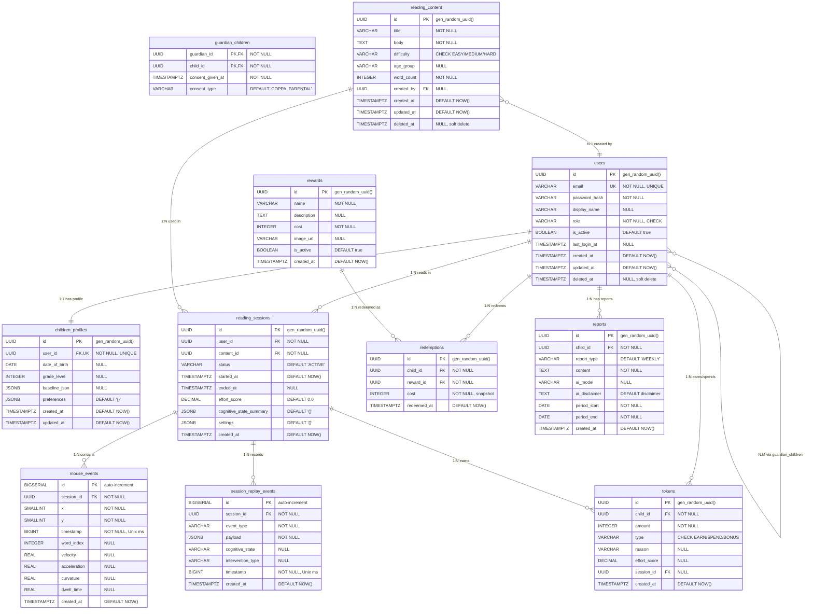

# ReadEase — Entity Relationship Diagram (ERD)

> **Version**: 2.0.0 | **Database**: PostgreSQL 16 | **Last Updated**: 2026-03-10

---

## Sơ đồ ERD (Mermaid)

---

## Tổng quan 11 bảng

| # | Bảng | PK Type | Mục đích | FK đến |
|---|------|---------|----------|--------|
| 1 | `users` | UUID | Tất cả user (CHILD, CLINICIAN, GUARDIAN) | — |
| 2 | `children_profiles` | UUID | Hồ sơ trẻ em: tuổi, lớp, baseline, preferences | `users.id` |
| 3 | `guardian_children` | Composite | Liên kết N:M phụ huynh ↔ trẻ (COPPA) | `users.id` × 2 |
| 4 | `reading_content` | UUID | Bài đọc với độ khó + nhóm tuổi | `users.id` |
| 5 | `reading_sessions` | UUID | Phiên đọc: start → end, effort, cognitive | `users.id`, `reading_content.id` |
| 6 | `mouse_events` | BIGSERIAL | Tọa độ chuột (volume lớn nhất) | `reading_sessions.id` |
| 7 | `session_replay_events` | BIGSERIAL | Sự kiện quan trọng để replay | `reading_sessions.id` |
| 8 | `tokens` | UUID | Giao dịch token economy | `users.id`, `reading_sessions.id` |
| 9 | `rewards` | UUID | Catalog phần thưởng | — |
| 10 | `redemptions` | UUID | Lịch sử đổi thưởng | `users.id`, `rewards.id` |
| 11 | `reports` | UUID | Báo cáo AI hàng tuần | `users.id` |

---

## Chi tiết Foreign Key

| # | Bảng chứa FK | Cột FK | → Bảng | → Cột | Quan hệ | Bắt buộc | ON DELETE |
|---|-------------|--------|--------|-------|---------|----------|-----------|
| 1 | `children_profiles` | `user_id` | `users` | `id` | 1:1 | ✅ | CASCADE |
| 2 | `guardian_children` | `guardian_id` | `users` | `id` | N:M | ✅ | CASCADE |
| 3 | `guardian_children` | `child_id` | `users` | `id` | N:M | ✅ | CASCADE |
| 4 | `reading_content` | `created_by` | `users` | `id` | N:1 | ❌ | SET NULL |
| 5 | `reading_sessions` | `user_id` | `users` | `id` | N:1 | ✅ | NO ACTION |
| 6 | `reading_sessions` | `content_id` | `reading_content` | `id` | N:1 | ✅ | NO ACTION |
| 7 | `mouse_events` | `session_id` | `reading_sessions` | `id` | N:1 | ✅ | CASCADE |
| 8 | `session_replay_events` | `session_id` | `reading_sessions` | `id` | N:1 | ✅ | CASCADE |
| 9 | `tokens` | `child_id` | `users` | `id` | N:1 | ✅ | NO ACTION |
| 10 | `tokens` | `session_id` | `reading_sessions` | `id` | N:1 | ❌ | SET NULL |
| 11 | `redemptions` | `child_id` | `users` | `id` | N:1 | ✅ | NO ACTION |
| 12 | `redemptions` | `reward_id` | `rewards` | `id` | N:1 | ✅ | NO ACTION |
| 13 | `reports` | `child_id` | `users` | `id` | N:1 | ✅ | CASCADE |

---

## Indexes

| Index | Bảng | Cột | Loại | Lý do |
|-------|------|-----|------|-------|
| `uq_users_email` | `users` | `email` | UNIQUE | Login lookup O(1) |
| `idx_users_role` | `users` | `role` | Partial (WHERE deleted_at IS NULL) | Filter active users by role |
| `idx_sessions_user_id` | `reading_sessions` | `user_id` | B-Tree | Dashboard query |
| `idx_sessions_status` | `reading_sessions` | `status` | Partial (WHERE status = 'ACTIVE') | Find active sessions |
| `idx_mouse_events_session_ts` | `mouse_events` | `session_id, timestamp` | B-Tree composite | Replay timeline |
| `idx_replay_session_ts` | `session_replay_events` | `session_id, timestamp` | B-Tree composite | Clinician replay |
| `idx_tokens_child_id` | `tokens` | `child_id` | B-Tree | Balance calculation |
| `idx_reports_child_period` | `reports` | `child_id, period_start` | B-Tree composite (DESC) | Latest report |
