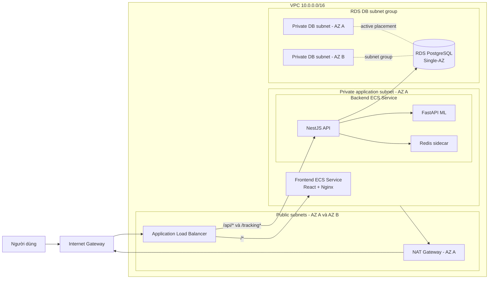
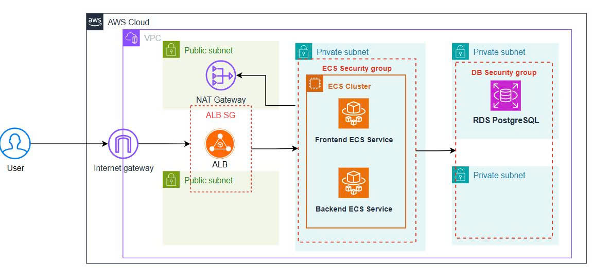

ReadEase là nền tảng đọc thích ứng dành cho trẻ gặp khó khăn khi đọc. Ứng dụng gồm frontend React, backend NestJS, một dịch vụ FastAPI cho ML, Redis phục vụ state ngắn hạn và PostgreSQL lưu dữ liệu nghiệp vụ. Bài viết này ghi lại quá trình triển khai ReadEase lên AWS bằng Terraform, từ việc chọn kiến trúc đến lúc chạy migration, kiểm tra health endpoint và xác nhận việc upload/download media trên S3.

Mục tiêu của deployment này là tạo một môi trường demo có thể tái tạo, đủ gần với production để thể hiện các kỹ năng cloud, nhưng vẫn giữ chi phí và độ phức tạp ở mức phù hợp cho một portfolio project. Vì vậy, đây không phải kiến trúc production hoàn chỉnh: workload chạy Single-AZ, ALB chỉ dùng HTTP và chưa có domain riêng.


---
## Kiến trúc tổng thể

Người dùng đi vào từ Internet Gateway tới Application Load Balancer. ALB định tuyến request frontend về frontend ECS service và các request API/WebSocket về backend ECS service. Cả hai ECS service chạy trong private application subnet, không có public IP.



---


### Vì sao có hai private DB subnet nhưng RDS chỉ chạy một nơi?

RDS yêu cầu DB subnet group có subnet ở ít nhất hai Availability Zone. Vì vậy Terraform tạo `Private DB A` và `Private DB B` trong một DB subnet group. Tuy nhiên, cấu hình `multi_az = false` khiến AWS chỉ đặt một RDS instance active trong một subnet. Subnet còn lại là subnet hợp lệ để DB subnet group đáp ứng yêu cầu của RDS, không phải một standby database.

Đây là điểm dễ gây nhầm khi vẽ architecture diagram: nên thể hiện cả hai subnet, nhưng chỉ vẽ một RDS instance đang active.

## ECS: frontend và backend chạy riêng

Frontend và backend đều chạy trên ECS Fargate nhưng là hai service độc lập:

- Frontend service chạy React build phía sau Nginx, lắng nghe port `80`.
- Backend service chạy ba container trong cùng một task:
  - NestJS API trên port `3000`.
  - FastAPI ML trên port `8000`, chỉ truy cập nội bộ qua `127.0.0.1`.
  - Redis trên port `6379`, dùng cho OTP và state ngắn hạn.

Backend container khai báo dependency để chỉ start sau khi Redis và ML container healthy. Redis và FastAPI không được expose ra Internet; chúng dùng chung network namespace với NestJS container.

ALB có hai listener rule chính:

| Path | ECS target |
|---|---|
| `/*` | Frontend service, port `80` |
| `/api/*` | Backend service, port `3000` |
| `/tracking` và `/tracking/*` | Backend WebSocket endpoint, port `3000` |

Cách tách service này cho phép frontend và backend có lifecycle riêng, đồng thời giữ mô hình triển khai đơn giản hơn so với việc đặt cả hai process trong một container.

## Database và migration

Terraform tạo RDS PostgreSQL 16 trong private DB subnet group với các đặc điểm:

- `publicly_accessible = false`.
- `multi_az = false`.
- Encryption at rest.
- Master password do AWS quản lý trong Secrets Manager.
- Security group chỉ cho phép backend SG truy cập port `5432`.

Sau khi ECS service chạy, migration không được chạy trong container production đang phục vụ request. Thay vào đó, tôi chạy một ECS one-off task trong private application subnet, dùng cùng backend task definition và security group:

```powershell
$cluster = terraform output -raw ecs_cluster_name
$taskDefinition = terraform output -raw backend_task_definition_arn
$subnet = terraform output -raw private_app_subnet_id
$securityGroup = terraform output -raw backend_security_group_id
$network = "awsvpcConfiguration={subnets=[$subnet],securityGroups=[$securityGroup],assignPublicIp=DISABLED}"

aws ecs run-task `
  --cluster $cluster `
  --launch-type FARGATE `
  --task-definition $taskDefinition `
  --network-configuration $network `
  --overrides '{"containerOverrides":[{"name":"backend","command":["npm","run","migration:run"]}]}'
```

Task migration đã chạy thành công cả 19 TypeORM migrations và kết thúc với exit code `0`.

Backend kết nối RDS bằng TLS. Trong demo, `DB_SSL_REJECT_UNAUTHORIZED=false` để đơn giản hóa việc đóng gói RDS CA bundle. Khi triển khai production, cần mount AWS RDS CA bundle và bật certificate verification.

## Chuyển storage từ Supabase sang S3

Một lỗi thực tế xuất hiện ngay sau lần deploy đầu tiên: tạo reading content trả HTTP `500` vì code backend vẫn gọi Supabase Storage, trong khi deployment chưa có Supabase credentials.

Terraform đã tạo private S3 media bucket và cấp IAM policy cho backend task role, vì vậy giải pháp hợp lý là chuyển storage adapter sang S3 thay vì mở public bucket hoặc thêm lại một dependency bên ngoài AWS.

`StorageService` hiện ưu tiên S3 khi biến `S3_MEDIA_BUCKET` tồn tại và vẫn hỗ trợ Supabase fallback cho môi trường cũ. Object được upload vào S3 với server-side encryption `AES256`. Vì bucket vẫn private, backend trả URL proxy cùng ALB:

```text
/api/v1/upload/file/content?key=stories/...
```

Khi frontend đọc content, request đi qua backend, backend dùng task role để lấy object từ S3 rồi trả nội dung về browser. Cách này giữ bucket private và không cần lưu một presigned URL ngắn hạn vào database.

Để xác nhận IAM và adapter hoạt động thật, tôi chạy một one-off ECS smoke test:

1. Upload một file text nhỏ vào S3.
2. Download lại object.
3. So sánh nội dung nhận được với nội dung ban đầu.
4. Xóa object test.

Log trả về `S3_SMOKE_OK`, cả ba container trong task đều exit code `0`.

## Terraform workflow

Terraform được chia thành các phần theo ownership boundary: network, security, ECR, logs, secrets, S3, RDS, IAM, ALB và ECS. `deploy_services` mặc định là `false` để có thể tạo platform và ECR trước, push image sau, rồi mới bật ECS service.

Quy trình triển khai gồm:

```powershell
terraform init
terraform fmt -check
terraform validate
terraform plan -out readease.tfplan
terraform apply readease.tfplan
```

Sau khi image đã có trong ECR, đặt `deploy_services = true` và chạy plan/apply lần hai để tạo frontend và backend service.

Khi cần cập nhật một image, các tag được tách riêng thành `frontend_image_tag`, `backend_image_tag` và `ml_image_tag`. Điều này tránh trường hợp đổi tag backend làm frontend hoặc ML trỏ tới một tag không tồn tại. Deployment sửa S3 dùng tag immutable `s3-storage-20260719-1` thay cho `latest`.

Điểm quan trọng nhất trong quy trình là không apply trực tiếp sau khi chỉnh code. Plan cho lần S3 rollout cho thấy đúng:

```text
1 to add, 1 to change, 1 to destroy
```

Resource bị destroy là task definition revision cũ để thay bằng revision mới; ECS service, VPC, subnet, RDS, S3, IAM và frontend không bị xóa. Sau apply, final plan trả về:

```text
No changes. Your infrastructure matches the configuration.
```

## Kết quả kiểm tra

Sau deployment, các kiểm tra chính đều thành công:

- Frontend target trên ALB: `healthy`.
- Backend target trên ALB: `healthy`.
- `GET /api/v1/health`: HTTP `200`.
- Health response xác nhận PostgreSQL kết nối được.
- 19 database migrations hoàn tất.
- S3 upload/download/delete smoke test: pass.
- Unit test cho S3 adapter và content service: `13/13` pass.
- Terraform validate: pass.
- Final Terraform plan: không có thay đổi.

Application endpoint hiện tại:

```text
http://readease-demo-alb-1388515170.ap-southeast-1.elb.amazonaws.com
```

## Những gì sẽ làm khác cho production?

Kiến trúc hiện tại phù hợp cho demo và portfolio, nhưng chưa nên dùng cho dữ liệu trẻ em thật. Các bước tiếp theo gồm:

- Thêm domain riêng, ACM certificate và chuyển ALB sang HTTPS.
- Dùng Multi-AZ cho ECS workload và RDS.
- Thay Redis sidecar ephemeral bằng dịch vụ có persistence và failover.
- Cấu hình SMTP production để gửi OTP, thay vì log OTP trong DEV mode.
- Thêm Gemini API key nếu muốn bật đầy đủ AI features.
- Thiết lập CloudWatch alarms, dashboard, tracing và alerting.
- Thêm CI/CD với immutable image tag theo commit SHA.
- Bảo vệ Terraform state bằng remote backend và state locking.
- Đánh giá lại IAM, retention policy, backup và data privacy trước khi lưu dữ liệu thật.

## Kết luận

Điều giá trị nhất của deployment này không chỉ là tạo được một VPC hay một ECS cluster. Phần khó hơn là nối các thành phần thành một hệ thống có thể kiểm chứng: private subnet tới NAT Gateway, ECS tới RDS bằng TLS, ECS task role tới private S3, migration chạy độc lập và ALB route đúng tới hai service.

ReadEase hiện đã chạy được trên AWS với frontend và backend tách biệt, database private, media private trên S3 và toàn bộ hạ tầng được quản lý bằng Terraform. Với một project học thuật hoặc portfolio, đây là điểm khởi đầu tốt để tiếp tục tiến tới HTTPS, Multi-AZ, observability và CI/CD production-grade.
