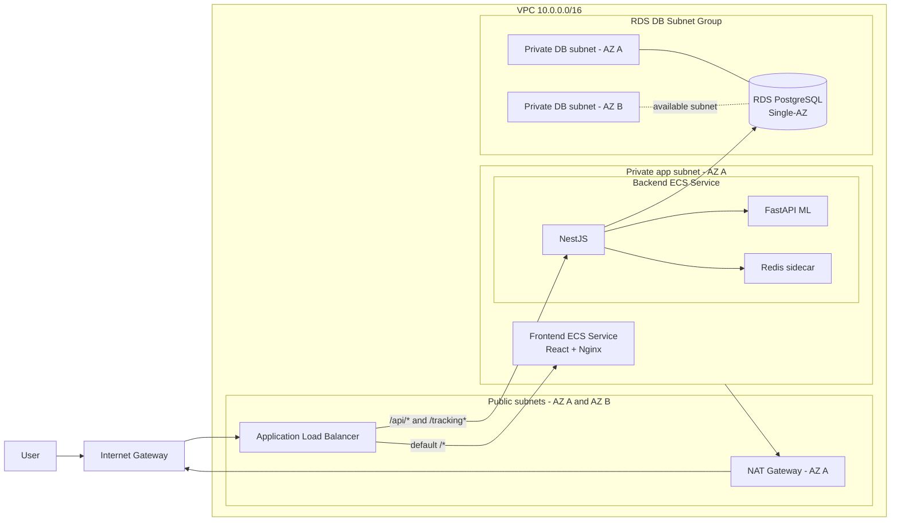

# ReadEase trên AWS

Bộ mã Terraform để triển khai frontend ReadEase, NestJS API, dịch vụ FastAPI ML, Redis và PostgreSQL trên AWS.

Cấu hình này được tối ưu cho môi trường portfolio/demo. Workload ứng dụng và RDS chạy trong một Availability Zone; ALB và DB subnet group vẫn sử dụng hai Availability Zone theo yêu cầu của AWS.

## Môi trường đã triển khai

Môi trường đã được triển khai và kiểm tra tại `ap-southeast-1` vào ngày 19/07/2026.

- Ứng dụng: `http://readease-demo-alb-1388515170.ap-southeast-1.elb.amazonaws.com`
- Target frontend và backend trên ALB: healthy
- Backend health endpoint: HTTP 200, kết nối PostgreSQL healthy
- Database: đã chạy thành công cả 19 TypeORM migrations
- Kiểm tra Terraform cuối: `No changes. Your infrastructure matches the configuration.`

Trong deployment demo này, Supabase Storage, Gemini và SMTP chưa được cấu hình. Ứng dụng vẫn khởi động nhờ cơ chế fallback, nhưng các tính năng phụ thuộc vào những integration này cần được thêm secret và redeploy backend.

## Kiến trúc



### Phân bố subnet

| Subnet | CIDR | Availability Zone | Mục đích |
|---|---:|---|---|
| Public A | `10.0.1.0/24` | AZ đầu tiên | ALB và NAT Gateway |
| Public B | `10.0.2.0/24` | AZ thứ hai | Đáp ứng yêu cầu của ALB |
| Private App A | `10.0.11.0/24` | AZ đầu tiên | ECS task frontend và backend |
| Private DB A | `10.0.21.0/24` | AZ đầu tiên | Vị trí active của RDS Single-AZ |
| Private DB B | `10.0.22.0/24` | AZ thứ hai | Yêu cầu của RDS DB subnet group |

Hai DB subnet tạo thành một DB subnet group. `multi_az = false` nghĩa là AWS chỉ đặt một RDS instance active trong một subnet; không tạo standby instance.

### Định tuyến ALB

| Path | Target |
|---|---|
| `/*` | Frontend ECS service trên port `80` |
| `/api/*` | NestJS container trên port `3000` |
| `/tracking` và `/tracking/*` | NestJS WebSocket endpoint trên port `3000` |

ALB có idle timeout 300 giây để hỗ trợ các kết nối WebSocket dài.

### Security group

- ALB SG: nhận HTTP public trên port `80`.
- Frontend SG: chỉ nhận port `80` từ ALB SG.
- Backend SG: chỉ nhận port `3000` từ ALB SG.
- Database SG: chỉ nhận PostgreSQL port `5432` từ backend SG.
- FastAPI và Redis không public. Hai container dùng chung network namespace với backend task và được gọi qua `127.0.0.1`.

## Các resource

- Một VPC, Internet Gateway, một NAT Gateway và S3 Gateway Endpoint.
- Hai public subnet, một private application subnet và hai private database subnet.
- Một public Application Load Balancer và hai target group.
- Một ECS Fargate cluster với frontend service và backend service riêng biệt.
- Backend task gồm các container NestJS, FastAPI ML và Redis.
- Ba ECR repository có image scanning và lifecycle policy.
- RDS PostgreSQL 16, encrypted, Single-AZ, sử dụng AWS-managed master password.
- Private encrypted S3 media bucket.
- Secrets Manager lưu application credentials.
- CloudWatch log group giữ log trong 7 ngày; không dùng dashboard, alarm hoặc Container Insights.

## Giới hạn quan trọng

- Public endpoint hiện dùng HTTP vì Route 53, CloudFront và ACM nằm ngoài thiết kế này. Không dùng cấu hình này cho dữ liệu trẻ em thật hoặc production. Trước khi launch thật cần thêm domain và ACM certificate.
- ECS kết nối RDS bằng TLS. Demo đặt `DB_SSL_REJECT_UNAUTHORIZED=false`; production nên thêm AWS RDS CA bundle và bật xác thực certificate.
- Redis sidecar là ephemeral. OTP, trajectory buffer và cached value sẽ mất khi backend task restart.
- Frontend, backend và RDS đều chạy Single-AZ. Sự cố tại AZ chính có thể làm ứng dụng unavailable.
- Backend dùng private S3 media bucket thông qua AWS SDK. File được đọc qua backend tại `/api/v1/upload/file/content?key=...`; Supabase vẫn được hỗ trợ làm fallback cho môi trường cũ.
- Các giá trị truyền qua `application_secrets` là sensitive nhưng vẫn được lưu trong Terraform state. Cần bảo vệ state và tuyệt đối không commit `terraform.tfvars` hoặc state file.
- NAT Gateway phát sinh phí theo giờ và phí xử lý dữ liệu kể cả khi traffic ứng dụng thấp.

## Điều kiện cần thiết

- Terraform `>= 1.10`
- AWS CLI đã authenticate với account đích
- Docker Desktop hoặc Docker Engine
- Backend repository: `ReadEase-BE/ReadEase-Backend`
- Frontend repository: `ReadEase-FE/ReadEase-Fontend`

Kiểm tra quyền truy cập AWS:

```powershell
aws sts get-caller-identity
aws configure get region
```

## 1. Cấu hình Terraform

Từ thư mục này:

```powershell
Copy-Item terraform.tfvars.example terraform.tfvars
```

Cập nhật `terraform.tfvars` với giá trị Supabase, Gemini và SMTP thật nếu cần. Giữ `deploy_services = false` ở lần apply đầu tiên vì ECR repository chưa có application image.

Khởi tạo và kiểm tra plan:

```powershell
terraform init
terraform fmt -check
terraform validate
terraform plan -out readease.tfplan
terraform apply readease.tfplan
```

Lần apply đầu tiên tạo platform, task definition và ECR repository nhưng chưa tạo ECS service.

## 2. Build và push image

Lấy URL của các repository:

```powershell
$frontendRepository = terraform output -raw frontend_ecr_repository_url
$backendRepository = terraform output -raw backend_ecr_repository_url
$mlRepository = terraform output -raw ml_ecr_repository_url
$registry = $frontendRepository.Split('/')[0]

aws ecr get-login-password --region ap-southeast-1 | docker login --username AWS --password-stdin $registry
```

Build và push backend, ML image từ root của backend repository:

```powershell
docker build -t "${backendRepository}:latest" .\backend
docker push "${backendRepository}:latest"

docker build -t "${mlRepository}:latest" .\ml-service
docker push "${mlRepository}:latest"
```

Build frontend bằng Dockerfile trong folder này. Frontend repository được dùng làm Docker build context:

```powershell
$frontendPath = 'D:\NCKH\ReadEase\ReadEase-FE\ReadEase-Fontend'
$frontendDockerfile = 'D:\NCKH\ReadEase\ReadEase-BE\ReadEase-Backend\terraform-aws\docker\frontend.Dockerfile'

docker build -f $frontendDockerfile -t "${frontendRepository}:latest" $frontendPath
docker push "${frontendRepository}:latest"
```

Frontend dùng relative API path, vì vậy REST và WebSocket traffic sử dụng cùng ALB hostname với web application.

## 3. Khởi động ECS service

Đặt giá trị sau trong `terraform.tfvars`:

```hcl
deploy_services = true
```

Apply lần thứ hai:

```powershell
terraform plan -out readease-services.tfplan
terraform apply readease-services.tfplan
```

Kiểm tra deployment:

```powershell
terraform output -raw application_url
aws ecs list-services --cluster (terraform output -raw ecs_cluster_name)
```

## 4. Chạy database migration

Chạy one-off backend task trong private application subnet:

```powershell
$cluster = terraform output -raw ecs_cluster_name
$taskDefinition = terraform output -raw backend_task_definition_arn
$subnet = terraform output -raw private_app_subnet_id
$securityGroup = terraform output -raw backend_security_group_id
$network = "awsvpcConfiguration={subnets=[$subnet],securityGroups=[$securityGroup],assignPublicIp=DISABLED}"

aws ecs run-task `
  --cluster $cluster `
  --launch-type FARGATE `
  --task-definition $taskDefinition `
  --network-configuration $network `
  --overrides '{"containerOverrides":[{"name":"backend","command":["npm","run","migration:run"]}]}'
```

Chờ task dừng và kiểm tra exit code `0` trong ECS Console hoặc bằng `aws ecs describe-tasks`.

## 5. Kiểm tra ReadEase

```powershell
$appUrl = terraform output -raw application_url
Invoke-RestMethod "$appUrl/api/v1/health"
```

Sau đó mở `application_url` trên trình duyệt và kiểm tra:

- React route load đúng sau khi refresh.
- Login và token refresh hoạt động.
- `/tracking` upgrade thành WebSocket connection.
- Reading session gửi mouse batch và nhận intervention event.
- CloudWatch log stream tồn tại cho frontend, backend, ML và Redis.

## Cập nhật image

Push image tag mới, cập nhật `frontend_image_tag`, `backend_image_tag` hoặc `ml_image_tag` tương ứng trong `terraform.tfvars`, sau đó apply:

```powershell
terraform plan -out readease-update.tfplan
terraform apply readease-update.tfplan
```

Khi bổ sung CI/CD, nên dùng immutable commit SHA tag thay cho `latest` để deployment có thể lặp lại chính xác.

## Xóa môi trường demo

RDS, NAT Gateway, ALB và Fargate phát sinh chi phí liên tục. Khi không còn cần môi trường demo:

```powershell
terraform plan -destroy -out readease-destroy.tfplan
terraform apply readease-destroy.tfplan
```

Xóa ECR sẽ thất bại nếu repository còn image, trừ khi đặt `force_delete_ecr = true`. Hãy kiểm tra media trên S3 và dữ liệu database trước khi destroy môi trường.
